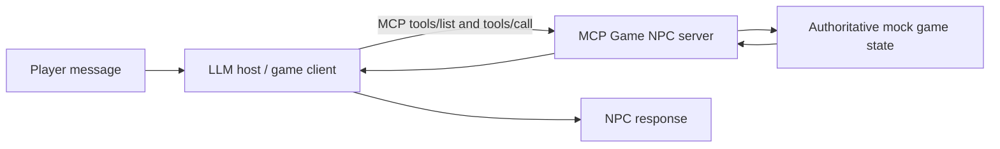

# MCP Game NPC

A deliberately small, runnable Model Context Protocol (MCP) server that shows how an AI-powered game NPC can read authoritative game state and perform a constrained game action instead of inventing facts in dialogue.

This is a learning project, not a production game integration. It uses mock in-memory data, three tools, and the official MCP Python SDK.

## The problem

An LLM can generate convincing dialogue, but it does not automatically know whether the player has a key, whether a quest is active, or whether an item was actually granted. If those facts live only in the prompt, they can be stale, incomplete, or hallucinated.

The safer boundary is:

1. The game remains the source of truth.
2. The NPC asks for current state through defined tools.
3. Write actions pass through validation and are visible as writes.
4. The model turns verified results into natural dialogue.

For example, the NPC should call `get_inventory()` before saying, “You already have the rusty key.” It should call `give_item()` before saying, “I have added a torch to your pack.”

## Architecture



The demo implements the server and a small protocol client. It deliberately does not bundle an LLM provider: any MCP-compatible host can discover and call the same tools, while `demo_client.py` proves the MCP boundary works without requiring an API key.

## How MCP fits

MCP standardizes the connection between an AI application (the host/client) and external capabilities (the server). The server publishes named tools with descriptions and input schemas. The host can expose those definitions to a model, execute an approved tool call, and return structured results to the model.

MCP does not decide the NPC's personality, choose a model, or make the game state authoritative. It provides the protocol boundary through which the host can discover and invoke capabilities.

## Project structure

```text
.
├── game_state.py          # Mock source of truth and validation rules
├── server.py              # Three MCP tool definitions
├── demo_client.py         # Runnable protocol-level example
├── tests/
│   ├── test_game_state.py
│   └── test_mcp_server.py
└── pyproject.toml
```

## Setup

Requirements: Python 3.10 or newer.

```bash
git clone https://github.com/astridasi/mcp-game-npc.git
cd mcp-game-npc
python -m venv .venv
source .venv/bin/activate        # Windows: .venv\Scripts\activate
python -m pip install -e ".[dev]"
```

The project pins `mcp==2.2.0`, the version used for this implementation and test run.

## Running the demo

Run the included client, which connects to the server in memory and invokes all three tools through MCP:

```bash
python demo_client.py
```

Run the server over standard input/output for an MCP host:

```bash
python server.py
```

Inspect the server interactively (requires the MCP CLI and Node.js for the Inspector):

```bash
mcp dev server.py
```

Run the tests:

```bash
pytest
```

## Tool definitions

| Tool | Input | Effect | Annotation intent |
| --- | --- | --- | --- |
| `get_inventory()` | None | Returns the current item list and quantities | Read-only, idempotent |
| `get_quest_state(quest_id)` | `quest_id: str` | Returns a known quest or an explicit not-found result | Read-only, idempotent |
| `give_item(item, quantity, reason)` | Item ID, quantity 1-5, audit reason | Adds an allowlisted item and records an audit event | Write, non-idempotent |

Tool annotations are useful signals to clients, not a security boundary. The server still validates every write.

## Example interaction

Player:

> I cannot see inside the watchtower. Can you help?

A host could let the NPC reason as follows:

1. Call `get_quest_state({"quest_id": "find_the_lost_map"})`.
2. Confirm that the quest is active and points to the old watchtower.
3. Call `get_inventory()` and confirm that no torch is present.
4. Ask for user confirmation if the product's policy requires it.
5. Call `give_item({"item": "torch", "quantity": 1, "reason": "Player accepted the watchtower quest."})`.
6. Generate dialogue from the returned state: “Take this torch. The old watchtower is your next objective.”

The important distinction is that the dialogue follows the tool results. The tool call is not merely decorative text generated by the NPC.

## Read tools versus write tools

`get_inventory` and `get_quest_state` observe state. Repeating either call does not change the game.

`give_item` changes state. It is intentionally marked non-idempotent: calling it twice grants twice. That makes confirmation, replay protection, authorization, and audit logging important in a real implementation.

Separating these categories helps a host apply different approval and logging policies. It also makes the tool surface easier for developers to reason about.

## Permissions and security considerations

This demo includes a few small controls:

- `give_item` accepts only an allowlist of low-risk items.
- Quantity is limited to 1-5.
- A non-empty reason is required and recorded.
- Read and write behavior is declared through tool annotations.
- The server has no network or filesystem access.

A production version would also need authenticated player/session identity, authorization checks, confirmation rules for sensitive actions, durable audit logs, transaction handling, rate limits, idempotency keys or replay protection, and monitoring. Tool descriptions and annotations must not be treated as enforcement. Clients should treat annotations as untrusted unless the server itself is trusted.

## Limitations

- State is in memory and resets when the process stops.
- There is one mock player and one quest.
- The client demonstrates MCP calls but does not include an LLM or game-engine adapter.
- There is no authentication, persistence, concurrency control, or network deployment.
- `give_item` is additive only; inventory removal and destructive actions are outside scope.
- The architecture is educational and intentionally avoids production infrastructure.

## What I learned

Building the smallest useful version clarified several points:

- MCP is the connection contract; the game service must still own state and business rules.
- Good tool descriptions and typed inputs improve discoverability, but server-side validation remains essential.
- Read tools and write tools need different trust, confirmation, and retry policies.
- Structured results are easier for a host to verify and pass back to a model than free-form strings.
- A runnable example, protocol-level test, and honest limitations section communicate more than a large but opaque architecture diagram.

I built this project while learning MCP and LLM application architecture. It demonstrates hands-on exploration and technical communication; it is not presented as production MCP experience.

## Companion article

For a longer explanation of the design decisions, protocol boundary, write-tool risks, and testing approach, read [Giving an AI Game NPC Tools: From Dialogue to Action with MCP](docs/giving-an-ai-game-npc-tools-with-mcp.md).

## References

- [Model Context Protocol documentation](https://modelcontextprotocol.io/docs/getting-started/intro)
- [Official MCP Python SDK](https://github.com/modelcontextprotocol/python-sdk)
- [MCP tool specification](https://modelcontextprotocol.io/specification/2025-11-25/server/tools)
- [MCP Inspector](https://modelcontextprotocol.io/docs/tools/inspector)
